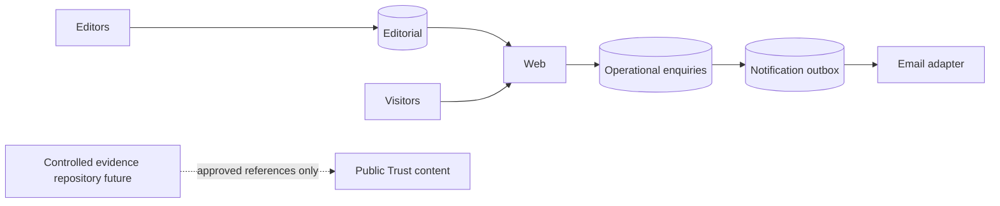

# Data ownership

```mermaid
flowchart LR
Editors --> Sanity[(Editorial)] --> Web
Visitors --> Web --> Enquiries[(Operational enquiries)]
Enquiries --> Outbox[(Notification outbox)] --> Email[Email adapter]
Evidence[Controlled evidence repository future] -. approved references only .-> Trust[Public Trust content]
```

Email failure never removes a stored enquiry. Public clients have no table privileges. Extracted services must own their persistence.
