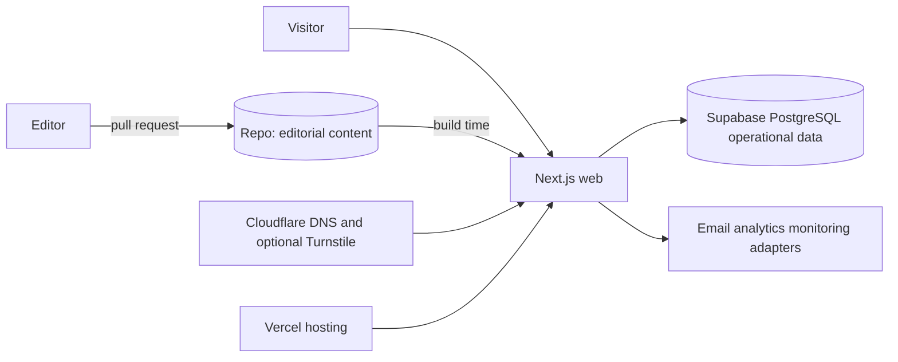

# System context

```mermaid
flowchart LR
Visitor --> Web[Next.js web]
Editor -->|pull request| Repo[(Repo: editorial content)]
Repo -->|build time| Web
Web --> Postgres[(Supabase PostgreSQL operational data)]
Web --> Providers[Email analytics monitoring adapters]
Cloudflare[Cloudflare DNS and optional Turnstile] --> Web
Vercel[Vercel hosting] --> Web
```

Only local/code foundations exist today; external production connections are future configuration.
